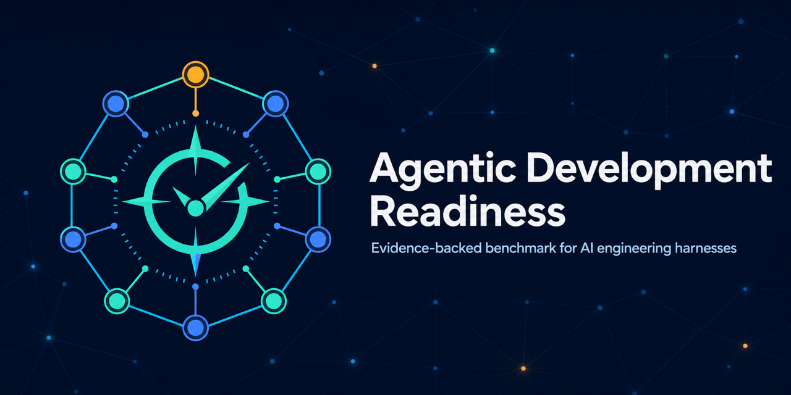

<p align="center">
  
</p>

# Agentic Development Readiness Benchmark

A vendor-neutral, evidence-backed benchmark for the engineering harness around AI coding agents.
It helps an organization answer a practical question:

> What work may our agents safely perform today, what evidence supports that decision, and what
> should we improve next?

The benchmark measures the harness, not the model brand. It assesses ten dimensions across four
maturity levels and applies non-compensating floors to five autonomy profiles. A high total score
cannot hide a critical security, testing, governance, or recovery gap.

This repository is a **v0.4 reference implementation** intended for public review and piloting. It
is not a certification standard. The immutable v0.1, v0.2, and v0.3 benchmarks remain available for
historical reproduction; scores from different benchmark versions are not directly comparable.

## Ask your coding agent

You do not need to install or learn the CLI yourself. Paste this instruction into Codex, Claude Code,
GitHub Copilot, Cursor, or another coding agent that has terminal access to your repository:

> Perform the complete ADRB v0.4 assessment of this repository for AI-agent pull-request work using
> `agentic-scorecard@0.4.0`. First select and state the commit without modifying my checkout; preserve
> HEAD when the checkout is dirty, and use upstream only if I requested the latest upstream state.
> Assess it from a clean worktree and keep all generated artifacts in a durable directory outside any
> temporary worktree. Run the tracked repository baseline, then run `init-evidence`, read its evidence
> request, and tell me which least-privileged read-only connected systems you need. Wait for my
> authorization before accessing them. After authorized collection, rerun the assessment and compare
> the baseline and assisted reports control by control. Keep repository-detected, agent-collected, and
> human-attested evidence separate; never invent evidence; treat UNKNOWN as unresolved; and leave
> generated artifacts uncommitted.

The complete copy-and-paste prompt, including privacy limits and exact commands, is in
[AGENT_PROMPT.md](AGENT_PROMPT.md). It makes the evidence-assisted workflow the recommendation. A
fast filesystem scan remains available, but it is explicitly a **repository-only baseline** and
cannot establish platform, organization, or outcome controls by itself.

The reference CLI/package and immutable benchmark are both version 0.4.0. Generated report and
evidence filenames use the benchmark version.

## Feedback and community

Real-world assessment feedback helps make the benchmark more accurate and useful across different
engineering organizations and agent harnesses.

- Share false positives, false negatives, unclear controls, and adoption experience through the
  [assessment feedback form](https://github.com/Planet-B2B/agentic-readiness/issues/new?template=assessment-feedback.yml).
- Propose scoring, control, evidence, or readiness-profile changes through the
  [benchmark change form](https://github.com/Planet-B2B/agentic-readiness/issues/new?template=benchmark-change.yml).
- Send private adoption questions or feedback that cannot be shared publicly to
  [benchmark@planetb2b.com](mailto:benchmark@planetb2b.com). Do not email vulnerability reports;
  follow [SECURITY.md](SECURITY.md) instead.

Ask a coding agent to prepare privacy-safe feedback with this prompt:

> Review my Agentic Development Readiness report and draft feedback for the
> `Planet-B2B/agentic-readiness` repository. Include the benchmark version, target profile, relevant
> control IDs, observed result, expected result, and a minimal sanitized explanation. Distinguish a
> likely scanner defect from a proposed benchmark-policy change. Do not include credentials,
> proprietary source, private URLs, personal data, customer data, or full report contents. Show me
> the draft and ask for my approval before opening a GitHub issue.

See [FEEDBACK.md](FEEDBACK.md) for the full feedback guide. If the project is useful to you, please
[star the repository](https://github.com/Planet-B2B/agentic-readiness) so others can discover it.

## Quick start

### Installation and prerequisites

A supported Node.js LTS release (20.19+, 22.13+, or 24+) is required. Assessment is local,
read-only, and offline by default.

```bash
npx agentic-scorecard@0.4.0 assess /path/to/repository \
  --profile pr-creation \
  --scope tracked \
  --format markdown \
  --output agentic-readiness.md
```

To record controls that repository inspection cannot prove:

```bash
npx agentic-scorecard@0.4.0 init /path/to/repository
```

Complete `.agentic/attestations.yaml` with owners and durable evidence links, then assess again.
Human-attested evidence remains visibly distinct in every report.

To let an authorized coding agent collect evidence from Git hosting, CI, dashboards, or other
external systems, first generate a target-bound template. The repository must be a Git worktree
with at least one commit so the bundle can bind to the exact assessed state:

```bash
npx agentic-scorecard@0.4.0 init-evidence /path/to/repository
```

Ask the agent to review `.agentic/evidence-request.md`, obtain approval before using
least-privileged read-only connectors, add attempted claims to `.agentic/agent-evidence.yaml`, and
rerun with `--agent-evidence`. The default bundle path is loaded automatically. See
[AGENT_PROMPT.md](AGENT_PROMPT.md) for the complete copy-and-paste workflow.

### Migrating from v0.1, v0.2, or v0.3

Run a new tracked-scope baseline and retain the old report as historical evidence. Do not present the
score change as improvement or regression because v0.4 changes evidence and control semantics.
Re-review prior attestations and agent evidence before recreating them for v0.4. All claims must
expire, and repository-scoped semantic claims require tracked files to match the commit-bound target
plus `repo:<path>[#Lx-Ly]` references whose optional line ranges exist in the cited tracked file.
Untracked generated reports do not block this workflow.

The default `.agentic/attestations.yaml` and `.agentic/agent-evidence.yaml` paths are migration-safe:
if either contains an older benchmark version, v0.4 ignores that auto-loaded file and places a
prominent warning in the report. Regenerate it with `init --force` or `init-evidence --force` before
relying on those claims. An explicitly supplied `--attestations` or `--agent-evidence` file still
fails closed on a version mismatch.

For development from this checkout:

```bash
npm ci
npm run check
npm run dev -- assess tests/fixtures/mature --profile pr-creation --attestations tests/fixtures/mature/.agentic/attestations-v0.4.yaml
```

## What it assesses

| Dimension                          | Core question                                                   |
| ---------------------------------- | --------------------------------------------------------------- |
| Context and knowledge              | Can an agent discover the right rules and architecture?         |
| Reproducible environment           | Can it establish a faithful, clean development environment?     |
| Specification and planning         | Is the requested outcome explicit and testable?                 |
| Tooling and interfaces             | Are tools scoped, validated, observable, and fail-safe?         |
| Security and data governance       | Are data, credentials, untrusted content, and autonomy bounded? |
| Verification and testing           | Can changes be verified with trustworthy signals?               |
| Review and change governance       | Are accountability, review, and merge authority explicit?       |
| Learning and knowledge maintenance | Do corrections become durable, maintained guidance?             |
| Outcome observability              | Can runs be evaluated by task, risk, quality, time, and cost?   |
| Failure containment and recovery   | Can work stop safely and changes be reversed?                   |

Each dimension receives the highest **consecutive** maturity level whose controls are satisfied:

0. Absent
1. Ad hoc
2. Documented
3. Enforced
4. Measured and improving

Level 4 requires outcome evidence over time. A dashboard, policy, or tool merely existing cannot
earn measured maturity.

## Readiness profiles

Profiles describe increasing authority. They are safety floors, not labels of organizational
prestige.

| Profile                          | Intended authority                                               |
| -------------------------------- | ---------------------------------------------------------------- |
| `read-only-analysis`             | Inspect approved source and return advice; no mutation.          |
| `planning`                       | Draft plans and specifications for human review.                 |
| `local-implementation`           | Edit an isolated checkout and run approved local checks.         |
| `pr-creation`                    | Create a branch and PR; a human retains merge authority.         |
| `limited-autonomous-maintenance` | Perform pre-approved, low-risk maintenance within strict limits. |

No profile grants production deployment authority. Organizations should evaluate production access
through a separate, system-specific safety case.

The exact floors live in
[`benchmark/v0.4/benchmark.yaml`](benchmark/v0.4/benchmark.yaml) and their rationale in
[`benchmark/v0.4/scoring-policy.md`](benchmark/v0.4/scoring-policy.md).

## Evidence scopes and trust labels

- **Repository-detected:** the local collector found qualifying evidence in the selected path scope.
  This proves an artifact match, not consistent practice or external enforcement.
- **Agent-collected:** an authorized agent supplied a target-bound, expiring, source-backed semantic
  repository or external claim for an explicitly eligible control. It is not independently
  verified and is never relabelled as repository-detected.
- **Human-attested:** an accountable owner supplied a dated evidence link or explanation.
- **Unknown:** evidence is unavailable, expired, unauthorized, mismatched, or inconclusive.

Controls also identify whether their evidence belongs in the repository, hosting platform,
organization, or outcome systems. This prevents expected external unknowns from masquerading as
missing files. Declarative detector adapters recognize common harness layouts without changing
portable control outcomes; future independently conformant external adapters require a separate
protocol. v0.4 does not issue certification or independent-verification claims.

### Interpreting the two score views

The normative score remains `N/40` and drives readiness profiles. v0.4 also reports
`repository-detected progress: A/C`, where `C` is the maximum consecutive maturity the offline
collector can establish without platform, organization, outcome, agent-collected, or human-attested
evidence. This second view explains how complete the visible repository harness is; it does not
normalize away UNKNOWNs, change readiness floors, or certify the project.

## Reports and CI

The CLI emits Markdown for people and stable JSON for automation:

```bash
agentic-scorecard assess . --scope tracked --format json --output .agentic/report.json
agentic-scorecard assess . --profile pr-creation --agent-evidence .agentic/agent-evidence.yaml
agentic-scorecard assess . --profile pr-creation --enforce
agentic-scorecard init-evidence .
agentic-scorecard explain ADRB-SEC-003
agentic-scorecard validate
```

`--enforce` exits with code 2 when the target profile fails. Start by publishing a non-blocking
baseline; gate only after owners have reviewed false positives, accepted the versioned policy, and
funded the remediation plan. See
[`examples/github-actions-consumer.yml`](examples/github-actions-consumer.yml).

## Privacy and security

The default collector:

- makes no network calls and invokes no model;
- reads only Git-tracked paths and records commit and dirty-worktree metadata;
- ignores `.git`, dependencies, build output, coverage, generated reports, attestations, and imported
  evidence bundles;
- caps content scanning at 512 KB per file, 5 MB total, and 250 candidates per check, with v0.4
  per-pattern balancing where configured;
- reports file paths and match counts, never matching source snippets;
- writes nothing unless `--output`, `init`, or `init-evidence` is explicitly requested.

Do not place credentials, private prompts, source excerpts, or personal data in attestations. Link to
access-controlled evidence instead. Report suspected vulnerabilities through [SECURITY.md](SECURITY.md).

## Repository structure

```text
benchmark/v0.1/       immutable historical v0.1 definition
benchmark/v0.2/       immutable historical v0.2 definition
benchmark/v0.3/       immutable historical v0.3 definition
benchmark/v0.4/       current normative benchmark, schemas, and controls
  adapters/           declarative path/term aliases for recognized agent harness layouts
benchmark/mappings/   informative mappings to external frameworks
src/                  reference CLI and local evidence collectors
templates/            adoption, preflight, attestation, and remediation templates
tests/fixtures/       transparent benchmark fixtures
rfcs/                 proposed normative changes
```

Normative changes use an RFC and create a new benchmark version; published versions remain
immutable. See [GOVERNANCE.md](GOVERNANCE.md) and [CONTRIBUTING.md](CONTRIBUTING.md).
Maintainers should follow [NPM_PUBLISHING.md](NPM_PUBLISHING.md) for the one-time bootstrap and
OIDC-provenance release process.

## Recommended adoption sequence

1. Run a local baseline for the least-authoritative profile you actually need.
2. Review every result with security, platform, and representative delivery teams.
3. Use an authorized agent to collect source-backed external evidence where appropriate.
4. Supply owned human attestations only where deterministic collection is unavailable.
5. Publish the report internally with explicit limitations, scope, commit, and benchmark version.
6. Fund the smallest improvements that close target-profile blockers.
7. Reassess on material harness changes and at least quarterly.
8. Add a non-blocking CI report; enforce only the agreed target profile after a pilot.

Never optimize to the number alone. Use the control evidence and outcome metrics to improve the
system, and keep exceptions narrow, owned, expiring, and visible.

## Status and roadmap

v0.4 adds semantic component evidence for containment guidance, partial-check reporting, structural
ownership maps, executable CI command detection, and separate Level 3 controls for secret scanning
and untrusted agent input. It retains portable harness adapters, source-backed semantic claims, and
the explanatory repository score and ceiling. Candidate next steps include conformant signed
adapters, broader structural CI command binding, SARIF/HTML reports, organization-level aggregation,
statistically designed benchmark tasks, and an independent-review protocol. These require public
design review before becoming normative.

Apache-2.0 licensed. The benchmark is a community engineering tool, not legal, compliance, or
security advice.
